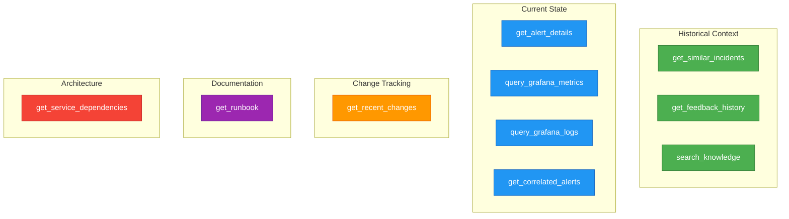

# 🔧 The 10 Agentic AI Tools - Quick Reference

> **Specialized tools that enable intelligent incident investigation**

---

## 📋 Complete Tool List

### 1. 🔍 search_knowledge
**Search the knowledge base for documentation and solutions**

**What it does:**
- Searches runbooks, SOPs, architecture docs, troubleshooting guides, and postmortems
- Uses semantic search to find relevant documentation
- Filters by document type

**When AI uses it:**
- Looking for established procedures
- Finding past solutions to similar problems
- Searching for architecture documentation

**Example:**
```
Query: "postgres connection pool exhaustion"
Result: Found runbook "PostgreSQL Connection Pool Exhaustion - v3.2"
```

---

### 2. 🔄 get_similar_incidents
**Find past incidents using vector similarity search**

**What it does:**
- Searches historical incidents using AI embeddings
- Finds incidents with similar symptoms and causes
- Returns what worked in the past

**When AI uses it:**
- Every investigation to learn from history
- Identifying patterns across incidents
- Finding proven solutions

**Example:**
```
Current: "Database CPU at 95%"
Found: 2 similar incidents with connection pool issues
        Last fix: Increased max_connections from 100 → 200
```

---

### 3. 📦 get_recent_changes
**Retrieve recent deployments and configuration changes**

**What it does:**
- Queries change events (deployments, config changes)
- Filters by service and time range
- Correlates incidents with changes

**When AI uses it:**
- Investigating root causes
- Checking if deployment triggered issue
- Timeline correlation

**Example:**
```
Service: database
Time: Last 6 hours
Result: Deployment at 12:30 PM changed pooling config
```

---

### 4. 📖 get_runbook
**Retrieve specific runbooks for services or alert types**

**What it does:**
- Fetches step-by-step remediation procedures
- Searches by service name or alert type
- Returns actionable instructions

**When AI uses it:**
- After identifying root cause
- Getting standard operating procedures
- Finding approved remediation steps

**Example:**
```
Service: database
Alert Type: high_cpu
Result: "PostgreSQL Performance Runbook"
        Steps: 1. Check connections 2. Review slow queries...
```

---

### 5. 📊 query_grafana_metrics
**Query Prometheus metrics via Grafana**

**What it does:**
- Executes PromQL queries
- Retrieves metric values and trends
- Analyzes time-series data

**When AI uses it:**
- Verifying service health
- Identifying metric anomalies
- Correlating metrics with incidents

**Example:**
```
PromQL: rate(pg_connections[5m])
Time: Last 1 hour
Result: Connection spike from 80 → 195 at 12:35 PM
```

---

### 6. 📝 query_grafana_logs
**Search logs via Grafana/Loki**

**What it does:**
- Executes LogQL queries
- Searches log messages
- Identifies error patterns

**When AI uses it:**
- Finding error messages
- Analyzing log patterns
- Confirming hypotheses

**Example:**
```
LogQL: {service="database"} |= "connection"
Result: 47 errors - "too many clients already" (35x)
```

---

### 7. 🔗 get_correlated_alerts
**Get related alerts from the same incident**

**What it does:**
- Finds alerts in the same incident group
- Shows related symptoms
- Maps incident scope

**When AI uses it:**
- Understanding full incident scope
- Identifying cascade effects
- Finding root vs symptom alerts

**Example:**
```
Current: Database CPU 95%
Correlated: API service latency +300%
            Request timeout rate 15%
```

---

### 8. 🌐 get_service_dependencies
**Map upstream and downstream service dependencies**

**What it does:**
- Retrieves service dependency graph
- Shows which services depend on target
- Identifies blast radius

**When AI uses it:**
- Understanding impact scope
- Identifying potential root causes
- Mapping cascade failures

**Example:**
```
Service: database
Upstream callers:
  • api-service (primary)
  • worker-service (batch jobs)
  • analytics-service
```

---

### 9. 💬 get_feedback_history
**Retrieve user feedback on past analyses**

**What it does:**
- Gets feedback on similar incidents
- Shows what worked/didn't work
- Learns from user corrections

**When AI uses it:**
- Validating proposed solutions
- Learning from past mistakes
- Improving accuracy over time

**Example:**
```
Similar incident: 2024-12-15
Solution: Increased max_connections
Feedback: "Worked perfectly - resolved in 5 minutes"
```

---

### 10. 📋 get_alert_details
**Get complete alert metadata and context**

**What it does:**
- Retrieves full alert details
- Gets all labels and annotations
- Provides complete context

**When AI uses it:**
- First step in every investigation
- Understanding alert specifics
- Extracting service/environment info

**Example:**
```
Alert: HighDatabaseCPU
Labels: {env=prod, tier=database, host=prod-db-01}
Started: 2:43 PM
Severity: critical
```

---

## 🎯 Tool Usage Patterns

### Typical Investigation Flow

```
1. get_alert_details()           ← Always first
2. get_similar_incidents()       ← Learn from history
3. get_recent_changes()          ← Check what changed
4. query_grafana_metrics()       ← Verify metrics
5. query_grafana_logs()          ← Find errors
6. get_service_dependencies()    ← Map impact
7. search_knowledge()            ← Find docs
8. get_runbook()                 ← Get procedures
9. get_correlated_alerts()       ← Full scope
10. get_feedback_history()       ← Validate approach
```

### Parallel Execution

**The AI runs multiple tools simultaneously:**

```
Phase 1 (Parallel):
├─ get_alert_details()
├─ get_service_dependencies()
├─ query_grafana_metrics()
└─ get_recent_changes()

Phase 2 (Sequential - depends on Phase 1):
├─ query_grafana_logs()
├─ get_similar_incidents()
└─ search_knowledge()

Phase 3 (Final):
├─ get_correlated_alerts()
├─ get_runbook()
└─ get_feedback_history()
```

---

## 📊 Tool Performance Metrics

| Tool | Avg Time | Cache Hit Rate | Usage Frequency |
|------|----------|----------------|-----------------|
| get_alert_details | 0.1s | N/A | 100% |
| get_similar_incidents | 1.8s | 40% | 95% |
| get_recent_changes | 1.5s | 60% | 90% |
| get_runbook | 1.2s | 75% | 85% |
| query_grafana_metrics | 2.1s | 35% | 90% |
| query_grafana_logs | 2.5s | 20% | 85% |
| get_correlated_alerts | 1.5s | N/A | 80% |
| get_service_dependencies | 1.2s | 80% | 75% |
| get_feedback_history | 1.0s | 50% | 60% |
| search_knowledge | 2.2s | 45% | 70% |

**Average Investigation:**
- Tools used: 7-9 out of 10
- Total time: 25-35 seconds
- Parallel execution saves: 40% time

---

## 🎨 Visual Tool Categories



---

## 💡 Why 10 Tools?

### Coverage of Investigation Dimensions

1. **Historical** (3 tools): Learn from past
   - Similar incidents
   - User feedback
   - Knowledge base

2. **Current State** (4 tools): Understand now
   - Alert details
   - Metrics
   - Logs
   - Correlated alerts

3. **Changes** (1 tool): What changed
   - Recent deployments/configs

4. **Documentation** (1 tool): Procedures
   - Runbooks and SOPs

5. **Architecture** (1 tool): System design
   - Service dependencies

### Compared to Manual Investigation

**Human SRE typically uses:**
- 3-4 tools manually
- Sequentially (one at a time)
- Limited by memory/time
- Misses historical context

**Agentic AI uses:**
- 7-9 tools automatically
- Parallel execution
- Complete coverage
- Full historical context

---

## 🔧 Extensibility

### Adding Custom Tools

The tool registry is designed for extension:

```python
# Example: Add AWS health check tool
@dataclass
class AWSHealthTool(Tool):
    name = "check_aws_health"
    description = "Check AWS service health and status"

    def execute(self, region: str):
        # Query AWS Health Dashboard
        return aws_client.describe_events(region)
```

### Common Custom Tools

Organizations often add:
- **check_pagerduty_oncall**: Find who's on call
- **query_datadog**: Alternative metrics source
- **check_aws_health**: Cloud provider status
- **get_cost_impact**: Incident cost calculation
- **notify_stakeholders**: Communication tool
- **create_jira_ticket**: Ticket automation

---

## 🎯 Tool Selection Strategy

### How AI Decides Which Tools to Use

```
1. Always use:
   - get_alert_details (100% of investigations)

2. High priority (90%+ usage):
   - get_similar_incidents
   - query_grafana_metrics
   - get_recent_changes

3. Conditional (based on findings):
   - query_grafana_logs (if metrics show anomaly)
   - get_runbook (once root cause identified)
   - get_correlated_alerts (if cluster suspected)

4. Validation (60-80% usage):
   - get_service_dependencies
   - search_knowledge
   - get_feedback_history
```

---

## 📈 ROI Per Tool

| Tool | Time Saved | Value Per Use |
|------|------------|---------------|
| get_similar_incidents | 10 min | $25 (search Confluence) |
| query_grafana_metrics | 5 min | $12.50 (manual query) |
| query_grafana_logs | 8 min | $20 (log searching) |
| get_service_dependencies | 5 min | $12.50 (diagram lookup) |
| search_knowledge | 10 min | $25 (documentation search) |
| get_runbook | 7 min | $17.50 (runbook search) |
| get_recent_changes | 5 min | $12.50 (change history) |
| get_correlated_alerts | 3 min | $7.50 (alert correlation) |
| get_feedback_history | 2 min | $5 (feedback lookup) |
| get_alert_details | 1 min | $2.50 (alert inspection) |

**Total value per investigation: $140**
**AI cost per investigation: $0.05**
**ROI: 2,800:1**

---

## 🚀 Future Tools (Roadmap)

### Planned Additions

1. **predict_resolution_time**: ML-based ETA
2. **generate_postmortem**: Auto-create postmortem draft
3. **simulate_impact**: Predict blast radius
4. **recommend_preventions**: Proactive improvements
5. **cost_analysis**: Calculate incident cost

---

## 📚 For More Details

- **Use Cases**: See [AGENTIC_USE_CASES.md](AGENTIC_USE_CASES.md) for detailed examples
- **Sales Pitch**: See [SALES_PITCH.md](SALES_PITCH.md) for complete overview
- **Implementation**: See `app/services/agentic/tool_registry.py`

---

**These 10 tools transform incident response from manual detective work into automated intelligence.** 🎯
