# 🤖 Agentic AI Use Cases - Step-by-Step Investigations

> **Real-world examples showing how the AI uses 10 specialized tools to investigate incidents**

---

## Use Case 1: Database CPU Spike Investigation

### 📊 Scenario
**Alert Received:** "PostgreSQL CPU at 95% on prod-db-01"
**Time:** 2:45 PM
**Severity:** Critical

### 🎯 Traditional Approach (45 minutes)
```
1. SRE sees PagerDuty alert (2 min)
2. Login to Grafana dashboard (3 min)
3. Check CPU metrics manually (5 min)
4. SSH to database server (2 min)
5. Run top, ps aux commands (5 min)
6. Check application logs (8 min)
7. Search Confluence for runbooks (10 min)
8. Identify connection pool issue (5 min)
9. Apply fix and verify (5 min)

Total: 45 minutes
```

### 🚀 Agentic AI Approach (30 seconds)

#### Visual: AI Investigation Flow

```mermaid
graph TB
    Start([🔔 Alert: Database CPU 95%]) --> Step1[🔍 Step 1: get_alert_details]

    Step1 --> Result1["📋 Result:<br/>Service: prod-db-01<br/>Labels: {'{'}env=prod, tier=database{'}'}<br/>Started: 2:43 PM"]

    Result1 --> Step2[🔍 Step 2: get_similar_incidents]

    Step2 --> Result2["📊 Result:<br/>Found 2 similar incidents:<br/>• 2024-12-15: Connection pool exhaustion<br/>• 2024-11-03: Slow query caused CPU spike"]

    Result2 --> Step3[🔍 Step 3: get_recent_changes]

    Step3 --> Result3["📦 Result:<br/>Deployment at 12:30 PM:<br/>• api-service v2.4.1 → v2.4.2<br/>• Changed connection pooling config"]

    Result3 --> Step4[🔍 Step 4: query_grafana_metrics]

    Step4 --> Result4["📈 Result:<br/>rate(pg_connections[5m]):<br/>• Normal: ~80 connections<br/>• Current: 195 connections<br/>• Spike started at 12:35 PM"]

    Result4 --> Step5[🔍 Step 5: query_grafana_logs]

    Step5 --> Result5["📝 Result:<br/>47 errors in last hour:<br/>• 'too many clients already' (35x)<br/>• 'connection pool exhausted' (12x)"]

    Result5 --> Step6[🔍 Step 6: get_service_dependencies]

    Step6 --> Result6["🔗 Result:<br/>Upstream services:<br/>• api-service (primary caller)<br/>• worker-service (batch jobs)<br/>• analytics-service"]

    Result6 --> Step7[🔍 Step 7: search_knowledge]

    Step7 --> Result7["📚 Result:<br/>Found runbook:<br/>'PostgreSQL Connection Pool<br/>Exhaustion - v3.2'"]

    Result7 --> Step8[🔍 Step 8: get_runbook]

    Step8 --> Result8["📖 Result:<br/>Remediation steps:<br/>1. Check current pool size<br/>2. Increase max_connections<br/>3. Restart PgBouncer<br/>4. Verify connection count"]

    Result8 --> Step9[🔍 Step 9: get_correlated_alerts]

    Step9 --> Result9["⚠️ Result:<br/>Related alerts firing:<br/>• API service latency +300%<br/>• Request timeout rate 15%"]

    Result9 --> Step10[🔍 Step 10: get_feedback_history]

    Step10 --> Result10["💡 Result:<br/>Similar issue on 2024-12-15:<br/>Fix: Increased max_connections<br/>from 100 → 200<br/>User feedback: 'Worked perfectly'"]

    Result10 --> Analysis[🧠 AI Analysis Complete]

    Analysis --> Output["✅ Output:<br/><br/><b>Root Cause:</b><br/>API service v2.4.2 deployment changed<br/>connection pooling behavior, causing<br/>connection pool exhaustion<br/><br/><b>Impact:</b><br/>• Database CPU at 95%<br/>• API latency increased 300%<br/>• 15% request timeout rate<br/><br/><b>Immediate Actions:</b><br/>1. Increase PostgreSQL max_connections<br/>   from 100 to 200<br/>2. Restart PgBouncer connection pooler<br/>3. Monitor connection count recovery<br/><br/><b>Remediation Commands:</b><br/>sudo -u postgres psql -c 'ALTER SYSTEM<br/>SET max_connections = 200;'<br/>sudo systemctl restart pgbouncer<br/>psql -c 'SELECT count(*) FROM pg_stat_activity;'<br/><br/><b>Prevention:</b><br/>• Add connection pool monitoring<br/>• Set alerts at 80% pool utilization<br/>• Review api-service v2.4.2 config<br/>• Add connection pool size to runbooks"]

    style Start fill:#f44336,stroke:#c62828,stroke-width:3px,color:#fff
    style Step1 fill:#2196F3,stroke:#1565C0,stroke-width:2px,color:#fff
    style Step2 fill:#2196F3,stroke:#1565C0,stroke-width:2px,color:#fff
    style Step3 fill:#2196F3,stroke:#1565C0,stroke-width:2px,color:#fff
    style Step4 fill:#2196F3,stroke:#1565C0,stroke-width:2px,color:#fff
    style Step5 fill:#2196F3,stroke:#1565C0,stroke-width:2px,color:#fff
    style Step6 fill:#2196F3,stroke:#1565C0,stroke-width:2px,color:#fff
    style Step7 fill:#2196F3,stroke:#1565C0,stroke-width:2px,color:#fff
    style Step8 fill:#2196F3,stroke:#1565C0,stroke-width:2px,color:#fff
    style Step9 fill:#2196F3,stroke:#1565C0,stroke-width:2px,color:#fff
    style Step10 fill:#2196F3,stroke:#1565C0,stroke-width:2px,color:#fff
    style Analysis fill:#4CAF50,stroke:#2E7D32,stroke-width:3px,color:#fff
    style Output fill:#FF9800,stroke:#E65100,stroke-width:3px,color:#fff
```



### 📊 Detailed Timeline Comparison

```
Traditional Manual Investigation:
├─ 0:00  Alert received
├─ 0:02  Login to Grafana
├─ 0:05  Check CPU metrics
├─ 0:10  Notice connection spike
├─ 0:12  SSH to database
├─ 0:17  Run diagnostic commands
├─ 0:25  Check application logs
├─ 0:35  Search for runbooks
├─ 0:42  Identify root cause
└─ 0:45  Apply fix

⏱️ Total: 45 minutes

━━━━━━━━━━━━━━━━━━━━━━━━━━━━━━━━━━━━━━━━━━━

Agentic AI Investigation:
├─ 0:00  Alert received
├─ 0:01  AI analyzes alert details
├─ 0:03  AI queries metrics (parallel)
├─ 0:03  AI searches logs (parallel)
├─ 0:03  AI checks changes (parallel)
├─ 0:05  AI finds similar incidents
├─ 0:08  AI retrieves runbook
├─ 0:10  AI correlates data
├─ 0:15  AI generates analysis
└─ 0:30  Complete analysis ready

⏱️ Total: 30 seconds

💰 Time Saved: 44.5 minutes (98.9% reduction)
```

### 🎯 Key Insights from AI Analysis

1. **Deployment Correlation**: AI linked the CPU spike to deployment 2 hours earlier
2. **Historical Learning**: AI found similar incident from last month with proven fix
3. **Impact Assessment**: AI identified 3 affected services through dependency graph
4. **Validated Solution**: AI confirmed fix worked in past based on user feedback
5. **Prevention Recommendations**: AI suggested monitoring improvements

---

## Use Case 2: Microservice Discovery Failure

### 📊 Scenario
**Alert Received:** "Service Discovery Failure - payment-service can't reach user-service"
**Time:** 10:15 AM
**Severity:** Critical

### 🚀 Agentic AI Investigation

```mermaid
graph TB
    Start([🔔 Alert: Service Discovery Failure]) --> Step1[🔍 Step 1: get_alert_details]

    Step1 --> Result1["📋 Alert Details:<br/>payment-service → user-service<br/>Error: 'No healthy endpoints found'<br/>Duration: 5 minutes"]

    Result1 --> Parallel{AI runs 3 tools in parallel}

    Parallel --> Step2A[🔍 Step 2a: get_service_dependencies]
    Parallel --> Step2B[🔍 Step 2b: query_grafana_metrics]
    Parallel --> Step2C[🔍 Step 2c: get_recent_changes]

    Step2A --> Result2A["🔗 Dependencies:<br/>payment-service depends on:<br/>• user-service (HTTP)<br/>• auth-service (gRPC)<br/>• db-service (PostgreSQL)"]

    Step2B --> Result2B["📈 Metrics:<br/>consul_catalog_services_critical:<br/>• user-service: 3/3 instances down<br/>• consul agent healthy: 2/3 nodes"]

    Step2C --> Result2C["📦 Recent Changes:<br/>• Kubernetes node drain at 10:10 AM<br/>• user-service pods rescheduled<br/>• Consul agent restart on node-23"]

    Result2A --> Step3[🔍 Step 3: query_grafana_logs]
    Result2B --> Step3
    Result2C --> Step3

    Step3 --> Result3["📝 Logs from user-service:<br/>'Failed to register with Consul'<br/>'Connection refused: consul-agent:8500'<br/>'Health check failing: agent unreachable'"]

    Result3 --> Step4[🔍 Step 4: get_similar_incidents]

    Step4 --> Result4["📊 Similar Incidents:<br/>2024-12-20: Consul agent crash<br/>Fix: Restart consul agent<br/>2024-11-10: Network policy blocked<br/>Fix: Update NetworkPolicy YAML"]

    Result4 --> Step5[🔍 Step 5: search_knowledge]

    Step5 --> Result5["📚 Knowledge Base:<br/>Found: 'Consul Agent Troubleshooting'<br/>Common causes:<br/>• Agent process crashed<br/>• Network policy misconfiguration<br/>• Resource limits exceeded"]

    Result5 --> Step6[🔍 Step 6: get_correlated_alerts]

    Step6 --> Result6["⚠️ Correlated Alerts:<br/>• Consul cluster size alert<br/>• user-service health check failing<br/>• payment-service error rate 25%"]

    Result6 --> Step7[🔍 Step 7: get_runbook]

    Step7 --> Result7["📖 Runbook:<br/>'Service Discovery Failures'<br/>Steps:<br/>1. Check consul agent status<br/>2. Verify network connectivity<br/>3. Review consul logs<br/>4. Restart agent if needed"]

    Result7 --> Analysis[🧠 AI Reasoning]

    Analysis --> Conclusion["💡 Root Cause Analysis:<br/><br/>Consul agent on node-23 failed to restart<br/>after node drain. user-service pods were<br/>rescheduled to node-23 but can't register<br/>because the local consul agent is down.<br/><br/>This matches the 2024-12-20 incident<br/>where consul agent crash caused similar<br/>service discovery failures."]

    Conclusion --> Output["✅ Complete Analysis:<br/><br/><b>Root Cause:</b><br/>Consul agent on node-23 is down after<br/>node drain event. user-service pods on<br/>this node cannot register for discovery.<br/><br/><b>Impact:</b><br/>• payment-service can't reach user-service<br/>• 25% payment error rate<br/>• All 3 user-service instances failing<br/><br/><b>Immediate Fix:</b><br/>1. SSH to node-23<br/>2. Check consul agent status<br/>3. Restart consul agent<br/>4. Verify service registration<br/><br/><b>Commands:</b><br/>ssh node-23<br/>sudo systemctl status consul<br/>sudo systemctl restart consul<br/>consul members<br/>consul catalog services | grep user-service<br/><br/><b>Verification:</b><br/>• Wait 30 seconds for health checks<br/>• Verify user-service appears in consul<br/>• Check payment-service error rate drops<br/><br/><b>Prevention:</b><br/>• Add consul agent monitoring<br/>• Create Kubernetes DaemonSet for consul<br/>• Add pre-drain hook to verify consul health<br/>• Document node drain procedures"]

    style Start fill:#f44336,stroke:#c62828,stroke-width:3px,color:#fff
    style Parallel fill:#9C27B0,stroke:#6A1B9A,stroke-width:3px,color:#fff
    style Step2A fill:#2196F3,stroke:#1565C0,stroke-width:2px,color:#fff
    style Step2B fill:#2196F3,stroke:#1565C0,stroke-width:2px,color:#fff
    style Step2C fill:#2196F3,stroke:#1565C0,stroke-width:2px,color:#fff
    style Analysis fill:#4CAF50,stroke:#2E7D32,stroke-width:3px,color:#fff
    style Conclusion fill:#FF9800,stroke:#E65100,stroke-width:2px,color:#fff
    style Output fill:#FF9800,stroke:#E65100,stroke-width:3px,color:#fff
```



### 📊 Tool Usage Breakdown

```
Tool Execution Order (Total: 30 seconds)
═══════════════════════════════════════════════

Parallel Phase 1 (0-3 seconds):
├─ get_alert_details()           → 0.5s
├─ get_service_dependencies()    → 1.2s
├─ query_grafana_metrics()       → 2.1s
└─ get_recent_changes()          → 1.8s

Sequential Phase 2 (3-10 seconds):
├─ query_grafana_logs()          → 2.5s
├─ get_similar_incidents()       → 1.8s
└─ search_knowledge()            → 2.2s

Sequential Phase 3 (10-20 seconds):
├─ get_correlated_alerts()       → 1.5s
└─ get_runbook()                 → 1.2s

Analysis Phase (20-30 seconds):
├─ AI reasoning and correlation  → 8.0s
└─ Generate structured output    → 2.0s

━━━━━━━━━━━━━━━━━━━━━━━━━━━━━━━━━━━━━━━━━━━━━━━

Total Time: 30 seconds
Tools Used: 9/10 (get_feedback_history not needed)
Parallel Execution: 3 tools (saves 5 seconds)
```

### 🎯 Why Parallel Execution Matters

**Sequential Execution (if not optimized):**
```
get_alert_details()        →  0.5s
get_service_dependencies() →  1.2s  (wait for previous)
query_grafana_metrics()    →  2.1s  (wait for previous)
get_recent_changes()       →  1.8s  (wait for previous)
... more tools ...

Total: 50+ seconds
```

**Parallel Execution (current implementation):**
```
get_alert_details()        →  0.5s
├─ get_service_dependencies()  →  1.2s  (parallel)
├─ query_grafana_metrics()     →  2.1s  (parallel)
└─ get_recent_changes()        →  1.8s  (parallel)
Wait for slowest: 2.1s

Total: 30 seconds (40% faster)
```

---

## 📈 Comparison Table

### Traditional vs Agentic AI

| Aspect | Traditional Manual | Agentic AI | Improvement |
|--------|-------------------|------------|-------------|
| **Alert Triage** | 15 minutes | 30 seconds | **96% faster** |
| **Tools Used** | 3-4 tools manually | 10 tools automatically | **2.5x more comprehensive** |
| **Context Gathering** | Serial (one at a time) | Parallel (3-4 at once) | **3x faster** |
| **Historical Learning** | Manual search | Automatic vector search | **100% coverage** |
| **Dependency Mapping** | Mental model | Automated graph | **Always accurate** |
| **Runbook Access** | Search Confluence | Instant retrieval | **No search time** |
| **Correlation** | Manual analysis | Automatic correlation | **No missed connections** |
| **Documentation** | Manual notes | Auto-generated | **100% documented** |

---

## 🎬 Demo Script Using These Use Cases

### 5-Minute Demo Flow

**Minute 1: Setup the Story**
```
"Imagine it's 2:45 PM and your database CPU spikes to 95%.
In the old world, you'd spend 45 minutes investigating.
Let me show you what happens with our Agentic AI..."
```

**Minute 2: Trigger Alert**
```
[Trigger test alert]
"Watch the AI activate. It's not just analyzing one thing—
it's using 10 specialized tools simultaneously."
```

**Minute 3: Show Real-Time Investigation**
```
[Point to screen showing AI tool calls]
"See this? The AI just:
• Checked alert metadata
• Found 2 similar past incidents
• Discovered a deployment 2 hours ago
• Queried Prometheus for connection metrics
• Scanned logs for errors
All in parallel, in under 5 seconds."
```

**Minute 4: Review Analysis**
```
[Show completed analysis]
"In 30 seconds, the AI has:
✅ Identified the root cause
✅ Linked it to a deployment
✅ Found the proven fix from history
✅ Generated step-by-step commands
✅ Suggested prevention measures

This would have taken you 45 minutes manually."
```

**Minute 5: Execute Fix**
```
[Click command in web terminal]
"Now watch this—one click to execute the fix.
The AI even monitors the resolution and verifies success.

Total time from alert to fix: 2 minutes.
Traditional approach: 45+ minutes.
You just saved 43 minutes on one incident."
```

---

## 💡 Key Selling Points

### For Technical Audiences
- **10 specialized tools** working in parallel
- **Vector similarity search** for historical incidents
- **Graph-based dependency mapping**
- **Native function calling** for OpenAI/Anthropic
- **ReAct pattern fallback** for local models

### For Business Audiences
- **98.9% time reduction** on alert triage
- **$1.4M annual savings** from faster resolution
- **Zero knowledge loss** - everything documented
- **24/7 expert-level** analysis
- **Proven ROI** in 30 days

### For Executives
- **Reduce MTTR by 78%** (45min → 10min)
- **Eliminate tribal knowledge** dependency
- **Scale without hiring** more SREs
- **Prevent cascading failures** through faster detection
- **Improve customer experience** with less downtime

---

## 🎯 Follow-Up Questions to Anticipate

**Q: "What if the AI gets it wrong?"**
> A: The AI provides analysis and recommendations, but humans make the final decision. Plus, we show all the data sources used, so you can verify. In practice, 85%+ accuracy rate, and it learns from feedback.

**Q: "How does it handle new types of incidents?"**
> A: The AI uses similarity search to find related incidents even if not exact matches. It also has access to general knowledge bases and runbooks. New incidents become part of the knowledge base for future reference.

**Q: "Can we customize the tools?"**
> A: Yes! The tool registry is extensible. You can add custom tools for your specific infrastructure (e.g., query_datadog, check_pagerduty_oncall, etc.)

**Q: "What about security and API costs?"**
> A: All credentials are encrypted. Self-hosted option keeps data in your VPC. For costs, analysis uses ~2-5K tokens per incident (typically $0.01-0.05 per analysis), far cheaper than engineer time.

---

## 📊 Success Metrics to Track

### Week 1
- ✅ Number of alerts auto-analyzed
- ✅ Average AI analysis time
- ✅ Tool usage patterns

### Month 1
- ✅ MTTR before/after comparison
- ✅ User satisfaction scores
- ✅ False positive rate
- ✅ Knowledge base growth

### Month 3
- ✅ Total time saved
- ✅ Incidents prevented through early detection
- ✅ ROI calculation
- ✅ Team productivity improvement

---

**These use cases demonstrate the true power of Agentic AI—not just faster, but smarter incident response.** 🚀
