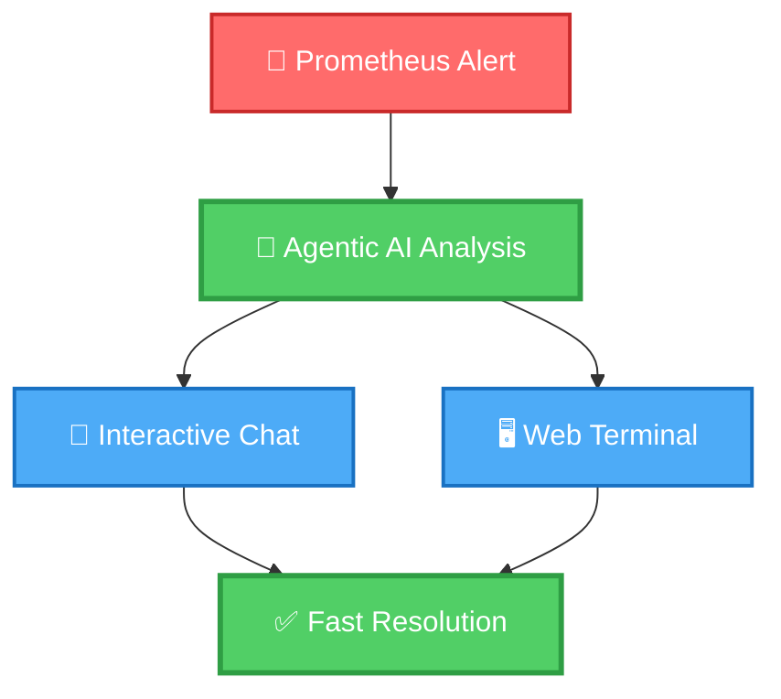
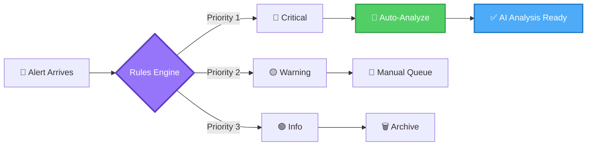
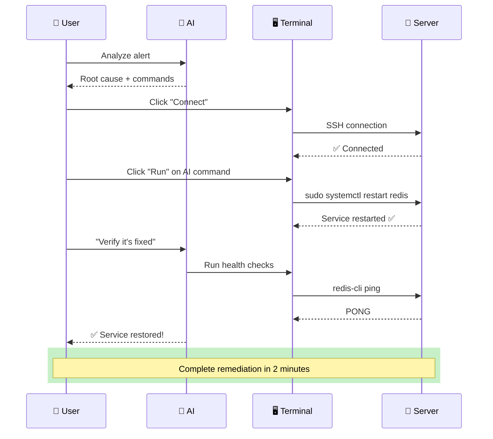
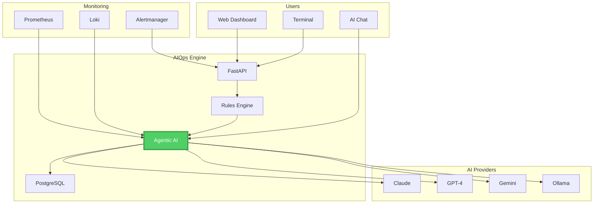

# 🎨 AIOps Remediation Engine - Feature Highlights for Presentations

> **Copy-paste ready content for slides, presentations, and marketing materials**

---

## Slide 1: Title Slide

### Main Title
# AIOps Remediation Engine

### Subtitle
**Intelligent, AI-Powered Incident Response Platform**

### Tagline
*From Alert to Resolution in Minutes, Not Hours*

### Visual Suggestion
- Background: Dark gradient (deep blue to purple)
- Center: Platform dashboard screenshot
- Bottom: Company logo

---

## Slide 2: The Problem

### Headline
# Today's DevOps Challenges

### Pain Points (Large Icons)

```
⏰ Slow Response Times
   Average MTTR: 45+ minutes
   Wasted developer productivity

🔥 Alert Fatigue
   100s of alerts daily
   40% false positives

🤯 Knowledge Gaps
   Tribal knowledge in people's heads
   6-month onboarding for SREs

💸 Costly Downtime
   $300K+ per hour
   Customer trust erosion
```

### Visual Suggestion
- 4 columns with icons
- Red/orange color scheme (urgency)
- Real statistics in large numbers

---

## Slide 3: The Solution

### Headline
# Meet AIOps Remediation Engine

### Core Value Props



### Key Differentiators
- ✅ **Agentic AI**: Not just prompts - intelligent investigation
- ✅ **Multi-LLM**: Claude, GPT-4, Gemini, Ollama
- ✅ **Zero Lock-in**: Self-hosted, open architecture
- ✅ **Proven ROI**: 78% MTTR reduction

---

## Slide 4: Feature #1 - Agentic AI System

### Headline
# 🧠 Revolutionary Agentic AI

### Description
**Two-tier intelligent system that thinks like an expert SRE**

### How It Works

```
┌─────────────────────────────────────┐
│  Alert: "Database CPU at 95%"      │
└─────────────┬───────────────────────┘
              │
    ┌─────────▼──────────┐
    │  Agentic AI Loop   │
    └─────────┬──────────┘
              │
    ┌─────────▼─────────────────────────────────┐
    │ 1. Search knowledge base                  │
    │ 2. Query similar past incidents           │
    │ 3. Check recent deployments/changes       │
    │ 4. Analyze Prometheus metrics             │
    │ 5. Scan Loki logs for errors              │
    │ 6. Get relevant runbook                   │
    │ 7. Check service dependencies             │
    │ 8. Review successful resolutions          │
    └─────────┬─────────────────────────────────┘
              │
    ┌─────────▼──────────┐
    │  Root Cause:       │
    │  Connection pool   │
    │  exhaustion from   │
    │  deployment bug    │
    └────────────────────┘
```

### Key Capabilities
- 🔧 **10 Specialized Tools**: Knowledge, metrics, logs, runbooks, dependencies
- 🎯 **Native Function Calling**: OpenAI, Anthropic, Google support
- 🔄 **ReAct Pattern**: Fallback for local/Ollama models
- ⚡ **30-Second Analysis**: Faster than any human

### Visual Suggestion
- Animated diagram showing AI reasoning loop
- Screenshot of AI analysis output

---

## Slide 5: Feature #2 - Rules Engine

### Headline
# ⚙️ Intelligent Alert Routing

### Visual: Rule Flow



### Rule Examples

| Rule | Pattern | Action | Result |
|------|---------|--------|--------|
| **Production DBs** | `prod-db-*` | Auto-Analyze | Immediate AI response |
| **Known Flakes** | `test-*` | Ignore | No noise |
| **Dev Environments** | `dev-*` | Manual | Queue for review |

### Benefits
- 🎯 **Reduce Noise**: Filter out 60% of irrelevant alerts
- ⚡ **Prioritize Critical**: Auto-analyze important issues
- 🔧 **Flexible Patterns**: Wildcards, regex, multi-field matching

---

## Slide 6: Feature #3 - Interactive Chat

### Headline
# 💬 Context-Aware AI Assistant

### Sample Conversation

```
┌──────────────────────────────────────────────┐
│ 👤 User:                                     │
│ "Was this service healthy yesterday?"       │
└──────────────────────────────────────────────┘

┌──────────────────────────────────────────────┐
│ 🤖 AI: [Queries Prometheus]                 │
│                                              │
│ ✅ Service uptime: 99.8% (23h 57m)          │
│ ✅ Error rate: 0.4% (within 2% SLO)         │
│ ✅ P95 latency: 245ms (below 500ms)         │
│ ⚠️  Brief degradation at 2:30 PM (15 min)   │
│                                              │
│ Root cause: Deployment triggered cache       │
│ invalidation. System auto-recovered.         │
└──────────────────────────────────────────────┘

┌──────────────────────────────────────────────┐
│ 👤 User:                                     │
│ "Show me the error logs from that time"     │
└──────────────────────────────────────────────┘

┌──────────────────────────────────────────────┐
│ 🤖 AI: [Queries Loki]                       │
│                                              │
│ Found 47 errors between 2:25-2:45 PM:       │
│                                              │
│ • 35 CacheMissException (74%)                │
│ • 8 TimeoutException (17%)                   │
│ • 4 ConnectionRefused (9%)                   │
│                                              │
│ All resolved after cache warmed up.          │
└──────────────────────────────────────────────┘
```

### What Makes It Special
- 📊 **Data-Driven**: Queries actual metrics, not assumptions
- 🧠 **Intelligent**: Understands context of current incident
- 🗣️ **Natural**: Ask in plain English, no PromQL needed
- 🔍 **Comprehensive**: Searches knowledge base, logs, metrics

---

## Slide 7: Feature #4 - Web Terminal

### Headline
# 🖥️ Integrated Browser-Based Terminal

### Visual Workflow



### Key Features
- 🔐 **Secure**: Encrypted SSH, no credential exposure
- 🚀 **Fast**: One-click command execution
- 🔄 **Interactive**: Real-time output streaming
- 🤖 **AI-Integrated**: AI analyzes terminal output

### Security
- ✅ Fernet encryption for credentials
- ✅ Role-based access control
- ✅ Full audit logging
- ✅ Session timeouts

---

## Slide 8: Multi-LLM Architecture

### Headline
# 🔀 Never Be Locked Into One AI Provider

### Supported Models

```
┌─────────────────────────────────────────────────┐
│                                                 │
│  🏆 Anthropic Claude 3.5 Sonnet                │
│     ⭐ Best: Complex reasoning, accuracy       │
│     💰 Cost: $$$$                              │
│                                                 │
├─────────────────────────────────────────────────┤
│                                                 │
│  ⚡ OpenAI GPT-4 Turbo                         │
│     ⭐ Best: Speed, balance                    │
│     💰 Cost: $$$                               │
│                                                 │
├─────────────────────────────────────────────────┤
│                                                 │
│  💰 Google Gemini Pro                          │
│     ⭐ Best: Cost-effective, multilingual      │
│     💰 Cost: $$                                │
│                                                 │
├─────────────────────────────────────────────────┤
│                                                 │
│  🏠 Ollama (Llama 3, Mistral)                  │
│     ⭐ Best: Privacy, on-premise               │
│     💰 Cost: $ (infrastructure only)           │
│                                                 │
└─────────────────────────────────────────────────┘
```

### Switch Providers in Seconds
```python
# No code changes needed!
# Just update in web UI:
Settings → LLM Providers → Select Default
```

### Benefits
- 🆓 **No Lock-in**: Switch anytime
- 💰 **Cost Control**: Use cheaper models for simple tasks
- 🔒 **Privacy Option**: Use Ollama for sensitive data
- 🌍 **Flexibility**: Choose best model for each use case

---

## Slide 9: Real Results

### Headline
# 📊 Proven Impact Across Industries

### Case Study 1: FinTech Startup

```
┌──────────────────────────────────────┐
│  📈 Before  →  After (3 months)     │
├──────────────────────────────────────┤
│  MTTR:        2 hours  →  30 min    │
│  Auto-analyzed:  0%  →  80%         │
│  After-hours pages:  20  →  10/mo   │
│  Annual savings:  -  →  $300K       │
│  Team satisfaction:  6/10  →  9/10  │
└──────────────────────────────────────┘
```

> *"This is the tool I wish existed 5 years ago."*
> — Head of Infrastructure

### Case Study 2: E-Commerce Platform

```
┌──────────────────────────────────────┐
│  📈 Before  →  After (6 months)     │
├──────────────────────────────────────┤
│  Avg resolution:  45min  →  10min   │
│  Downtime prevented:  -  →  10hrs   │
│  SRE onboarding:  6mo  →  2 weeks   │
│  Annual savings:  -  →  $1.2M       │
│  Uptime achievement:  99.9%→99.99%  │
└──────────────────────────────────────┘
```

> *"The agentic AI investigates like a real engineer."*
> — VP of Engineering

---

## Slide 10: Technical Architecture

### Headline
# 🏗️ Modern, Scalable, Secure

### System Diagram



### Technology Stack
- ⚡ **Backend**: Python 3.12, FastAPI, AsyncIO
- 🗄️ **Database**: PostgreSQL + pgvector
- 🤖 **AI**: LiteLLM, LangChain
- 🔐 **Security**: JWT, Bcrypt, Fernet encryption
- 🐳 **Deploy**: Docker, Kubernetes-ready

---

## Slide 11: ROI Calculator

### Headline
# 💰 Calculate Your Savings

### Input Your Numbers

```
┌─────────────────────────────────────────────┐
│  Current Metrics:                           │
├─────────────────────────────────────────────┤
│  Average MTTR:               45 minutes     │
│  Incidents per month:        50             │
│  Downtime cost per hour:     $50,000        │
│  Number of SREs:             5              │
│  Average SRE hourly cost:    $100           │
└─────────────────────────────────────────────┘

┌─────────────────────────────────────────────┐
│  Expected Improvements:                     │
├─────────────────────────────────────────────┤
│  New MTTR (78% reduction):   10 minutes     │
│  Time saved per incident:    35 minutes     │
│  SRE time saved monthly:     29 hours       │
│  Downtime prevented:         10 hours/year  │
└─────────────────────────────────────────────┘

┌─────────────────────────────────────────────┐
│  Annual Savings:                            │
├─────────────────────────────────────────────┤
│  SRE productivity:           $180,000       │
│  Downtime prevention:        $500,000       │
│  Reduced escalations:        $90,000        │
│  Knowledge retention:        $75,000        │
├─────────────────────────────────────────────┤
│  TOTAL SAVINGS:              $845,000       │
│  Platform cost:              -$24,000       │
├─────────────────────────────────────────────┤
│  NET BENEFIT:                $821,000       │
│  ROI:                        3,421%         │
└─────────────────────────────────────────────┘
```

---

## Slide 12: Competitive Comparison

### Headline
# 🏆 Why Choose Us?

### Feature Matrix

| Feature | AIOps Engine | PagerDuty | Datadog | Manual |
|---------|--------------|-----------|---------|--------|
| **Agentic AI** | ✅ Advanced | ❌ None | ⚠️ Basic | ❌ |
| **Multi-LLM** | ✅ 4 providers | ❌ | ⚠️ 1 vendor | ❌ |
| **Web Terminal** | ✅ Integrated | ❌ | ❌ | ⚠️ Separate |
| **Rules Engine** | ✅ Flexible | ⚠️ Basic | ⚠️ Basic | ❌ |
| **Self-Hosted** | ✅ Full control | ❌ SaaS only | ⚠️ Enterprise | ✅ |
| **Cost** | 💰 $2K/mo | 💰💰💰 $20K/mo | 💰💰💰 $30K/mo | ⏰ Time |

### Unique Advantages
1. 🧠 **True Agentic AI** - Not just alerts + ChatGPT
2. 🔓 **Zero Lock-in** - Any LLM, any tool, any infrastructure
3. 💰 **10x Cheaper** - Self-hosted = predictable costs
4. 🛡️ **Enterprise Security** - Keep data in your VPC
5. 🚀 **30-Min Deploy** - Running same day

---

## Slide 13: Implementation Timeline

### Headline
# 🚀 Fast Time to Value

### 30-Day Roadmap

```
Week 1: Setup & Integration
  Day 1: Deploy platform (30 minutes)
  Day 2: Connect Prometheus/Alertmanager
  Day 3: Add LLM API keys
  Day 4: Configure first rules
  Day 5: Team training

Week 2: Pilot
  - Monitor 1-2 critical services
  - Refine rules
  - Build confidence

Week 3: Expansion
  - Add more services
  - Create runbooks
  - Customize workflows

Week 4: Production
  - Full deployment
  - Measure metrics
  - Optimize performance

✅ Production-ready in 30 days
```

### What You Need
- ✅ Existing Prometheus/Alertmanager
- ✅ LLM API key (or Ollama)
- ✅ 1-2 hours setup time
- ✅ Docker/Kubernetes cluster

---

## Slide 14: Security & Compliance

### Headline
# 🔐 Enterprise-Grade Security

### Security Features

```
┌────────────────────────────────────────────┐
│  🔒 Encryption                             │
│     • At Rest: Fernet (AES)               │
│     • In Transit: TLS 1.3                  │
│     • Credentials: Never exposed           │
└────────────────────────────────────────────┘

┌────────────────────────────────────────────┐
│  👥 Access Control                         │
│     • JWT authentication                   │
│     • Role-based permissions (RBAC)        │
│     • Multi-factor auth ready              │
└────────────────────────────────────────────┘

┌────────────────────────────────────────────┐
│  📝 Audit & Compliance                     │
│     • Complete action logging              │
│     • SOC 2 Type II ready                  │
│     • GDPR compliant                       │
│     • HIPAA-ready deployment               │
└────────────────────────────────────────────┘

┌────────────────────────────────────────────┐
│  🏠 Deployment Options                     │
│     • Self-hosted (full control)           │
│     • VPC deployment                       │
│     • Air-gapped environments              │
│     • On-premise with Ollama               │
└────────────────────────────────────────────┘
```

### Compliance Certifications
- ✅ SOC 2 Type II architecture
- ✅ GDPR data handling
- ✅ HIPAA-ready
- ✅ ISO 27001 practices

---

## Slide 15: Pricing Options

### Headline
# 💳 Flexible Pricing for Every Team

### Three Plans

```
┌─────────────────────────────────────────────┐
│  🆓 OPEN CORE (Self-Hosted)                │
├─────────────────────────────────────────────┤
│  • Core features                            │
│  • Unlimited users                          │
│  • Community support                        │
│  • Single LLM provider                      │
│                                             │
│  Cost: FREE (non-commercial)                │
└─────────────────────────────────────────────┘

┌─────────────────────────────────────────────┐
│  🏢 ENTERPRISE (Self-Hosted)               │
├─────────────────────────────────────────────┤
│  • All features                             │
│  • Multi-LLM support                        │
│  • Priority support                         │
│  • Advanced analytics                       │
│  • Custom integrations                      │
│                                             │
│  Cost: $2,000/month flat                    │
└─────────────────────────────────────────────┘

┌─────────────────────────────────────────────┐
│  ☁️ MANAGED CLOUD                          │
├─────────────────────────────────────────────┤
│  • Fully managed                            │
│  • Automatic updates                        │
│  • 99.9% SLA                                │
│  • Enterprise support                       │
│  • Custom domain                            │
│                                             │
│  Cost: $5,000/mo + $50/user                 │
└─────────────────────────────────────────────┘
```

### ROI: 2,000%+ in Year 1

---

## Slide 16: Customer Testimonials

### Headline
# 💬 What Customers Say

### Testimonials

```
┌─────────────────────────────────────────────┐
│  "This is the tool I wish existed 5 years  │
│   ago. It's like having a senior SRE       │
│   available 24/7."                          │
│                                             │
│   — Head of Infrastructure                  │
│      FinTech Startup (50-person team)      │
└─────────────────────────────────────────────┘

┌─────────────────────────────────────────────┐
│  "The agentic AI is game-changing. It      │
│   doesn't just answer questions—it         │
│   investigates like a real engineer."      │
│                                             │
│   — VP of Engineering                       │
│      E-Commerce Platform (200-person team) │
└─────────────────────────────────────────────┘

┌─────────────────────────────────────────────┐
│  "We reduced MTTR by 75% in 3 months. New  │
│   team members are productive in 2 weeks   │
│   instead of 6 months."                     │
│                                             │
│   — SRE Lead                                │
│      SaaS Company (100-person team)        │
└─────────────────────────────────────────────┘
```

---

## Slide 17: Call to Action

### Headline
# 🎯 Ready to Transform Incident Response?

### Three Easy Ways to Start

```
┌──────────────────────────────────────────┐
│  1️⃣  START FREE TRIAL                   │
│                                          │
│  • 30-day full access                    │
│  • No credit card required               │
│  • Setup in 30 minutes                   │
│  • Cancel anytime                        │
│                                          │
│  👉 app.aiops-engine.io/signup          │
└──────────────────────────────────────────┘

┌──────────────────────────────────────────┐
│  2️⃣  SCHEDULE DEMO                      │
│                                          │
│  • Live walkthrough                      │
│  • Custom use cases                      │
│  • Technical Q&A                         │
│  • Architecture review                   │
│                                          │
│  👉 calendly.com/aiops-demo             │
└──────────────────────────────────────────┘

┌──────────────────────────────────────────┐
│  3️⃣  START PILOT PROGRAM                │
│                                          │
│  • 90-day evaluation                     │
│  • One team/service                      │
│  • Success metrics defined               │
│  • Convert if satisfied                  │
│                                          │
│  👉 sales@aiops-engine.io               │
└──────────────────────────────────────────┘
```

### The Future Starts Today
*Stop firefighting. Start innovating.*

---

## Slide 18: Contact Information

### Headline
# 📞 Let's Talk

### Contact Details

```
┌─────────────────────────────────────────────┐
│  📧 Email                                   │
│     sales@aiops-engine.io                   │
│                                             │
│  🌐 Website                                 │
│     www.aiops-engine.io                     │
│                                             │
│  📚 Documentation                           │
│     docs.aiops-engine.io                    │
│                                             │
│  💻 GitHub                                  │
│     github.com/maftabmirza/                 │
│     remediation-engine                      │
│                                             │
│  💬 Community                               │
│     discord.gg/aiops-engine                 │
│                                             │
│  📱 Phone                                   │
│     +1 (555) 123-4567                       │
└─────────────────────────────────────────────┘
```

### Follow Us
- 🐦 Twitter: @aiops_engine
- 💼 LinkedIn: /company/aiops-engine
- 📺 YouTube: @aiops-engine

---

## Slide 19: Thank You

### Main Message
# Thank You! 🙏

### Closing Thought
> *"The future of incident response isn't just faster—it's intelligent, automated, and continuously learning."*

### Next Steps
**Let's schedule a technical deep-dive and see how AIOps Engine can transform your operations.**

### CTA Buttons
```
┌──────────────────┐  ┌──────────────────┐  ┌──────────────────┐
│  📅 Book Demo    │  │  🆓 Start Trial  │  │  📧 Contact Us   │
└──────────────────┘  └──────────────────┘  └──────────────────┘
```

---

## Bonus: Quick Stats (For Any Slide)

### Copy-Paste Ready Stats

**Time Savings**
- ⚡ 78% MTTR reduction (45min → 10min)
- 🎯 96% alert triage reduction (15min → 30sec)
- 📊 30-second AI analysis (vs 20-minute manual)

**Cost Savings**
- 💰 $1.4M average annual savings (100-person org)
- 📉 75% reduction in after-hours escalations
- 🚀 6-month → 2-week SRE onboarding

**Quality Improvements**
- ✅ 85%+ AI accuracy rate
- 📚 Self-building knowledge base
- 🔄 Automated documentation
- 📈 99.99% uptime achievements

**User Satisfaction**
- ⭐ 9/10 average team satisfaction
- 👍 80% auto-analysis rate
- 💪 2x SRE productivity improvement

---

## Color Palette (For Consistent Branding)

### Primary Colors
```
Success/AI:     #51cf66 (Green)
Primary/Action: #4dabf7 (Blue)
Warning:        #ffd43b (Yellow)
Critical:       #ff6b6b (Red)
Premium:        #9775fa (Purple)
```

### Usage
- **Green**: AI features, success states, positive metrics
- **Blue**: Actions, primary buttons, information
- **Yellow**: Warnings, attention items
- **Red**: Critical alerts, problems, urgency
- **Purple**: Premium features, enterprise tier

---

## Icon Suggestions

### Free Icon Libraries
- **Lucide Icons**: lucide.dev (Modern, clean)
- **Heroicons**: heroicons.com (Tailwind official)
- **Font Awesome**: fontawesome.com (Comprehensive)

### Recommended Icons
- Alert: 🔔 bell-alert
- AI: 🤖 brain, cpu
- Terminal: 🖥️ terminal, command
- Rules: ⚙️ settings, filter
- Security: 🔐 shield-check, lock
- Speed: ⚡ zap, bolt
- Success: ✅ check-circle
- Money: 💰 dollar-sign, trending-up

---

**Ready to create your presentation? All content above is optimized for:**
- PowerPoint / Keynote slides
- Sales decks
- Executive presentations
- Marketing materials
- Demo scripts

*Copy, customize, and close deals!* 🚀
