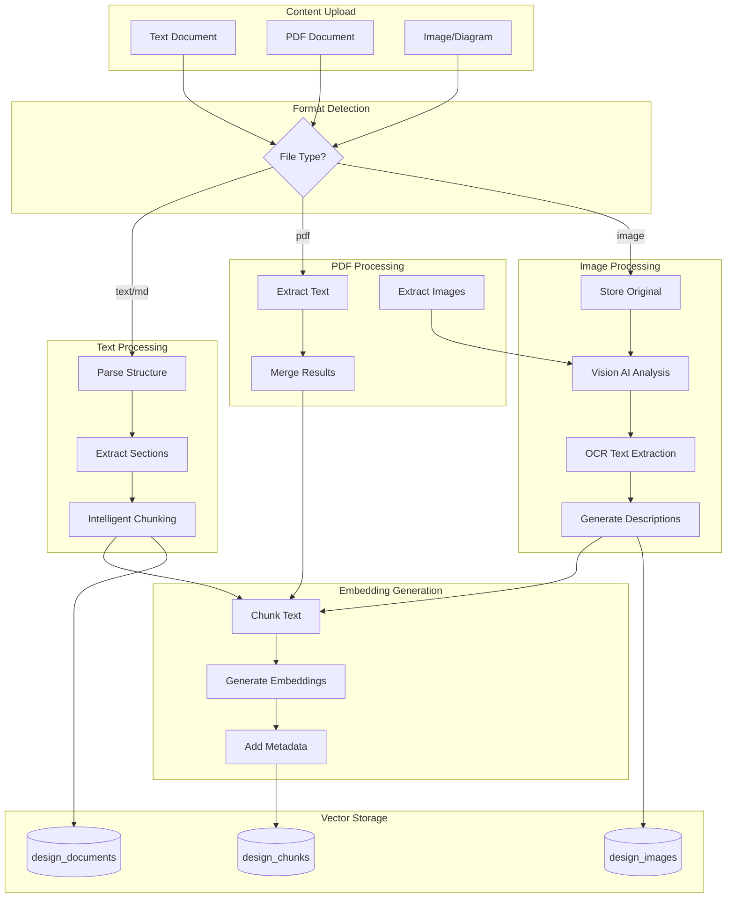

# AIOps Remediation Engine - Technical Design Document

**Version:** 1.0
**Last Updated:** December 2024
**Status:** Draft for Review
**Authors:** Engineering Team

---

## Table of Contents

1. [Executive Summary](#1-executive-summary)
2. [System Overview](#2-system-overview)
3. [Architecture Design](#3-architecture-design)
4. [Data Models](#4-data-models)
5. [Core Workflows](#5-core-workflows)
6. [Learning System Design](#6-learning-system-design)
7. [Multi-Modal Knowledge Storage](#7-multi-modal-knowledge-storage)
8. [Complex Troubleshooting Engine](#8-complex-troubleshooting-engine)
9. [API Specifications](#9-api-specifications)
10. [Implementation Roadmap](#10-implementation-roadmap)
11. [Developer Guidelines](#11-developer-guidelines)

---

## 1. Executive Summary

### 1.1 Purpose

This document describes the technical design for transforming the AIOps Remediation Engine from a reactive incident response tool into an **intelligent learning platform** that:

- Learns from every incident and remediation outcome
- Understands complex distributed system architectures
- Correlates alerts across components to find root causes
- Surfaces relevant knowledge (SOPs, design docs, diagrams) contextually
- Continuously improves recommendations based on feedback

### 1.2 Key Capabilities

| Capability | Description |
|------------|-------------|
| **Learning System** | Captures feedback, tracks outcomes, improves over time |
| **Knowledge Base** | Stores SOPs, design docs, architecture diagrams |
| **Multi-Modal Processing** | Handles text and images (architecture diagrams) |
| **Dependency Mapping** | Understands service relationships |
| **Root Cause Analysis** | Correlates alerts to find actual problems |
| **Historical Context** | Leverages past incidents for faster resolution |

### 1.3 Technology Stack

```
┌─────────────────────────────────────────────────────────────────┐
│                      TECHNOLOGY STACK                            │
├─────────────────────────────────────────────────────────────────┤
│  Database:        PostgreSQL 16 + pgvector extension            │
│  Backend:         FastAPI (Python 3.11+)                        │
│  Vector Search:   pgvector (1536 dimensions)                    │
│  Embeddings:      OpenAI text-embedding-3-small                 │
│  Vision AI:       Claude 3.5 Sonnet / GPT-4V                    │
│  LLM:             Claude / GPT-4 / Ollama (via LiteLLM)         │
│  Frontend:        Jinja2 Templates + JavaScript                 │
│  Queue:           APScheduler (upgradeable to Redis/Celery)     │
└─────────────────────────────────────────────────────────────────┘
```

---

## 2. System Overview

### 2.1 High-Level Architecture


### 2.2 Component Responsibilities

| Component | Responsibility |
|-----------|----------------|
| **API Gateway** | Request routing, authentication, rate limiting |
| **Alert Processing Engine** | Receives alerts, matches rules, triggers analysis |
| **Learning Engine** | Collects feedback, calculates effectiveness, improves recommendations |
| **Knowledge Base** | Stores and retrieves SOPs, design docs, diagrams |
| **Troubleshooting Engine** | Correlates alerts, maps dependencies, finds root cause |
| **LLM Service** | Generates analysis with enriched context |
| **Embedding Service** | Converts text to vectors for similarity search |
| **Vision AI Service** | Analyzes architecture diagrams |

---

## 3. Architecture Design

### 3.1 Service Architecture


### 3.2 Data Flow Architecture


---

## 4. Data Models

### 4.1 Entity Relationship Diagram


### 4.2 Core Tables

#### 4.2.1 Application Registry

```sql
-- Stores registered applications in the system
CREATE TABLE applications (
    id UUID PRIMARY KEY DEFAULT gen_random_uuid(),
    name VARCHAR(100) NOT NULL UNIQUE,
    display_name VARCHAR(200),
    description TEXT,
    team_owner VARCHAR(100),
    criticality VARCHAR(20) CHECK (criticality IN ('critical', 'high', 'medium', 'low')),
    tech_stack JSONB DEFAULT '{}',
    alert_label_matchers JSONB DEFAULT '{}',  -- How to match alerts to this app
    created_at TIMESTAMP DEFAULT NOW(),
    updated_at TIMESTAMP DEFAULT NOW()
);

-- Example:
-- {
--   "name": "video-platform",
--   "display_name": "Video Streaming Platform",
--   "team_owner": "streaming-team",
--   "criticality": "critical",
--   "tech_stack": {"languages": ["python", "go"], "databases": ["postgresql", "redis"]},
--   "alert_label_matchers": {"app": "video-platform", "namespace": "streaming"}
-- }
```

#### 4.2.2 Component Registry

```sql
-- Stores components within applications
CREATE TABLE application_components (
    id UUID PRIMARY KEY DEFAULT gen_random_uuid(),
    app_id UUID NOT NULL REFERENCES applications(id) ON DELETE CASCADE,
    name VARCHAR(100) NOT NULL,
    component_type VARCHAR(50) CHECK (component_type IN (
        'compute', 'database', 'cache', 'queue', 'storage',
        'cdn', 'load_balancer', 'api_gateway', 'external'
    )),
    description TEXT,
    endpoints JSONB DEFAULT '{}',  -- {host, port, health_check_url}
    alert_label_matchers JSONB DEFAULT '{}',  -- How to match alerts to this component
    criticality VARCHAR(20) DEFAULT 'high',
    created_at TIMESTAMP DEFAULT NOW(),
    updated_at TIMESTAMP DEFAULT NOW(),

    UNIQUE(app_id, name)
);

-- Component dependencies (edges in the dependency graph)
CREATE TABLE component_dependencies (
    id UUID PRIMARY KEY DEFAULT gen_random_uuid(),
    from_component_id UUID NOT NULL REFERENCES application_components(id) ON DELETE CASCADE,
    to_component_id UUID NOT NULL REFERENCES application_components(id) ON DELETE CASCADE,
    dependency_type VARCHAR(20) CHECK (dependency_type IN ('sync', 'async', 'optional')),
    failure_impact TEXT,  -- What happens when this dependency fails
    created_at TIMESTAMP DEFAULT NOW(),

    UNIQUE(from_component_id, to_component_id)
);
```

#### 4.2.3 Design Documents & Images

```sql
-- Stores design documents (text-based)
CREATE TABLE design_documents (
    id UUID PRIMARY KEY DEFAULT gen_random_uuid(),
    app_id UUID REFERENCES applications(id) ON DELETE CASCADE,
    title VARCHAR(500) NOT NULL,
    slug VARCHAR(500) UNIQUE,
    doc_type VARCHAR(50) CHECK (doc_type IN (
        'architecture', 'api_spec', 'runbook', 'sop',
        'troubleshooting', 'design_doc', 'postmortem', 'onboarding'
    )),
    format VARCHAR(20) CHECK (format IN ('markdown', 'pdf', 'html', 'yaml')),
    raw_content TEXT,
    source_url VARCHAR(1000),  -- Original location (git, confluence)
    source_type VARCHAR(50),   -- 'git', 'confluence', 'manual'
    version INTEGER DEFAULT 1,
    status VARCHAR(20) DEFAULT 'active',
    created_by UUID REFERENCES users(id),
    created_at TIMESTAMP DEFAULT NOW(),
    updated_at TIMESTAMP DEFAULT NOW()
);

-- Stores design images (architecture diagrams, flowcharts)
CREATE TABLE design_images (
    id UUID PRIMARY KEY DEFAULT gen_random_uuid(),
    app_id UUID REFERENCES applications(id) ON DELETE CASCADE,
    document_id UUID REFERENCES design_documents(id) ON DELETE SET NULL,
    title VARCHAR(500) NOT NULL,
    image_type VARCHAR(50) CHECK (image_type IN (
        'architecture', 'flowchart', 'sequence', 'erd',
        'network', 'deployment', 'component', 'other'
    )),
    storage_path VARCHAR(1000) NOT NULL,  -- Path in object storage
    thumbnail_path VARCHAR(1000),
    file_size_bytes INTEGER,
    mime_type VARCHAR(100),

    -- AI-extracted information
    ai_description TEXT,           -- Vision AI generated description
    extracted_text TEXT,           -- OCR extracted text
    identified_components JSONB,   -- Components found in image
    identified_connections JSONB,  -- Connections/flows found
    failure_scenarios JSONB,       -- Inferred failure scenarios

    processing_status VARCHAR(20) DEFAULT 'pending',
    processed_at TIMESTAMP,
    created_by UUID REFERENCES users(id),
    created_at TIMESTAMP DEFAULT NOW()
);
```

#### 4.2.4 Knowledge Chunks (Vector Storage)

```sql
-- Enable pgvector extension
CREATE EXTENSION IF NOT EXISTS vector;

-- Stores chunked content with embeddings for similarity search
CREATE TABLE design_chunks (
    id UUID PRIMARY KEY DEFAULT gen_random_uuid(),
    app_id UUID REFERENCES applications(id) ON DELETE CASCADE,

    -- Source tracking
    source_type VARCHAR(50) CHECK (source_type IN ('document', 'image', 'component', 'alert_history')),
    source_id UUID NOT NULL,  -- FK to source table
    chunk_index INTEGER DEFAULT 0,  -- Order within source

    -- Content
    content TEXT NOT NULL,
    content_type VARCHAR(50) CHECK (content_type IN (
        'text', 'image_description', 'ocr', 'component_info',
        'failure_mode', 'troubleshooting', 'dependency_info'
    )),

    -- Vector embedding (1536 dimensions for OpenAI text-embedding-3-small)
    embedding vector(1536),

    -- Metadata for filtering
    metadata JSONB DEFAULT '{}',  -- {section, page, component_refs, tags}

    created_at TIMESTAMP DEFAULT NOW()
);

-- Create vector index for similarity search
CREATE INDEX design_chunks_embedding_idx ON design_chunks
USING ivfflat (embedding vector_cosine_ops) WITH (lists = 100);

-- Create index for filtering
CREATE INDEX design_chunks_app_idx ON design_chunks(app_id);
CREATE INDEX design_chunks_source_idx ON design_chunks(source_type, source_id);
CREATE INDEX design_chunks_metadata_idx ON design_chunks USING gin(metadata);
```

#### 4.2.5 Feedback & Learning Tables

```sql
-- Feedback on AI analysis quality
CREATE TABLE analysis_feedback (
    id UUID PRIMARY KEY DEFAULT gen_random_uuid(),
    alert_id UUID NOT NULL REFERENCES alerts(id) ON DELETE CASCADE,
    user_id UUID NOT NULL REFERENCES users(id),

    -- Quick feedback
    helpful BOOLEAN,
    rating INTEGER CHECK (rating BETWEEN 1 AND 5),

    -- Detailed feedback
    accuracy VARCHAR(30) CHECK (accuracy IN ('accurate', 'partially_accurate', 'inaccurate')),
    actionability VARCHAR(30) CHECK (actionability IN ('actionable', 'vague', 'wrong_direction')),

    -- Free-form
    comments TEXT,
    what_was_missing TEXT,
    what_actually_worked TEXT,

    created_at TIMESTAMP DEFAULT NOW()
);

-- Execution outcome tracking
CREATE TABLE execution_outcomes (
    id UUID PRIMARY KEY DEFAULT gen_random_uuid(),
    execution_id UUID NOT NULL REFERENCES runbook_executions(id) ON DELETE CASCADE,
    alert_id UUID REFERENCES alerts(id),
    user_id UUID NOT NULL REFERENCES users(id),

    -- Outcome
    resolved_issue BOOLEAN,
    resolution_type VARCHAR(30) CHECK (resolution_type IN ('full', 'partial', 'no_effect', 'made_worse')),

    -- Timing
    time_to_resolution_minutes INTEGER,

    -- Learning
    recommendation_followed BOOLEAN,
    manual_steps_taken TEXT,
    improvement_suggestion TEXT,

    created_at TIMESTAMP DEFAULT NOW()
);

-- Historical failure patterns (learned from data)
CREATE TABLE failure_patterns (
    id UUID PRIMARY KEY DEFAULT gen_random_uuid(),
    app_id UUID REFERENCES applications(id),

    -- Pattern definition
    pattern_name VARCHAR(200) NOT NULL,
    pattern_type VARCHAR(50) CHECK (pattern_type IN (
        'single_service', 'cascading', 'time_based', 'deployment_related'
    )),

    -- Pattern signature
    symptom_alerts JSONB,       -- Alert patterns that indicate this failure
    root_cause_component_id UUID REFERENCES application_components(id),
    root_cause_description TEXT,

    -- Resolution
    resolution_steps JSONB,
    recommended_runbook_id UUID REFERENCES runbooks(id),

    -- Statistics
    occurrence_count INTEGER DEFAULT 0,
    success_rate DECIMAL(5,2),
    avg_resolution_minutes INTEGER,

    -- Status
    is_active BOOLEAN DEFAULT true,
    last_occurred_at TIMESTAMP,
    created_at TIMESTAMP DEFAULT NOW(),
    updated_at TIMESTAMP DEFAULT NOW()
);

-- Alert correlation groups
CREATE TABLE alert_correlations (
    id UUID PRIMARY KEY DEFAULT gen_random_uuid(),

    -- Correlation window
    correlation_window_start TIMESTAMP NOT NULL,
    correlation_window_end TIMESTAMP NOT NULL,

    -- Alerts in this group
    alert_ids UUID[] NOT NULL,

    -- Analysis
    root_cause_alert_id UUID REFERENCES alerts(id),
    root_cause_component_id UUID REFERENCES application_components(id),
    root_cause_confidence DECIMAL(5,2),

    -- Causal chain
    causal_chain JSONB,  -- [{alert_id, caused_by, time_delta_seconds}]

    -- Resolution
    resolution_summary TEXT,
    resolved_at TIMESTAMP,

    created_at TIMESTAMP DEFAULT NOW()
);
```

### 4.3 Adding Embeddings to Existing Tables

```sql
-- Add embedding column to alerts for similarity search
ALTER TABLE alerts ADD COLUMN IF NOT EXISTS embedding vector(1536);
ALTER TABLE alerts ADD COLUMN IF NOT EXISTS embedding_text TEXT;  -- Text used to generate embedding

-- Create index for alert similarity search
CREATE INDEX IF NOT EXISTS alerts_embedding_idx ON alerts
USING ivfflat (embedding vector_cosine_ops) WITH (lists = 100);

-- Add embedding column to runbooks
ALTER TABLE runbooks ADD COLUMN IF NOT EXISTS embedding vector(1536);
ALTER TABLE runbooks ADD COLUMN IF NOT EXISTS embedding_text TEXT;

CREATE INDEX IF NOT EXISTS runbooks_embedding_idx ON runbooks
USING ivfflat (embedding vector_cosine_ops) WITH (lists = 100);
```

---

## 5. Core Workflows

### 5.1 Alert Processing Workflow


### 5.2 Knowledge Ingestion Workflow


### 5.3 Image Processing Workflow


### 5.4 Learning Feedback Loop

```mermaid
flowchart TB
    subgraph Collection["Feedback Collection"]
        A1[Analysis Feedback 👍/👎]
        A2[Execution Outcome]
        A3[User Behavior Signals]
    end

    A1 --> B[Feedback Aggregator]
    A2 --> B
    A3 --> B

    B --> C{Analyze Patterns}

    C --> D[Runbook Effectiveness]
    C --> E[AI Analysis Quality]
    C --> F[Knowledge Relevance]

    D --> G[Update Runbook Scores]
    E --> H[Improve Prompt Templates]
    F --> I[Adjust Relevance Weights]

    G --> J[Better Runbook Matching]
    H --> K[More Accurate Analysis]
    I --> L[Better Knowledge Surfacing]

    J --> M[Improved User Experience]
    K --> M
    L --> M

    M --> N[More User Engagement]
    N --> A1
    N --> A2
    N --> A3

    subgraph Metrics["Learning Metrics"]
        M1[Success Rate per Runbook]
        M2[MTTR Improvement]
        M3[Feedback Sentiment]
        M4[Resolution Accuracy]
    end

    G --> M1
    J --> M2
    B --> M3
    K --> M4
```



### 5.5 Complex Troubleshooting Workflow


### 5.6 Root Cause Correlation Algorithm


---

## 6. Learning System Design

### 6.1 Learning Data Flow


### 6.2 Effectiveness Scoring Model


### 6.3 Similarity Search Flow


---

## 7. Multi-Modal Knowledge Storage

### 7.1 Content Processing Pipeline



### 7.2 Vision AI Processing Detail


### 7.3 Chunking Strategy


---

## 8. Complex Troubleshooting Engine

### 8.1 Dependency Graph Resolution


### 8.2 Investigation Path Generation


### 8.3 Alert Storm Handling


---

## 9. API Specifications

### 9.1 Application Registry APIs

```yaml
# Register a new application
POST /api/v1/applications
Request:
  {
    "name": "video-platform",
    "display_name": "Video Streaming Platform",
    "description": "Handles video upload, transcoding, and streaming",
    "team_owner": "streaming-team",
    "criticality": "critical",
    "tech_stack": {
      "languages": ["python", "go"],
      "frameworks": ["fastapi", "gin"],
      "databases": ["postgresql", "redis"]
    },
    "alert_label_matchers": {
      "app": "video-platform",
      "namespace": "streaming"
    }
  }
Response: 201 Created
  {
    "id": "uuid",
    "name": "video-platform",
    ...
  }

# Get application with components
GET /api/v1/applications/{app_id}?include=components,documents
Response: 200 OK
  {
    "id": "uuid",
    "name": "video-platform",
    "components": [...],
    "documents": [...],
    "stats": {
      "total_alerts": 150,
      "open_alerts": 3,
      "mttr_minutes": 12.5
    }
  }

# Register component
POST /api/v1/applications/{app_id}/components
Request:
  {
    "name": "api-server",
    "component_type": "compute",
    "description": "Main API server handling all REST requests",
    "endpoints": {
      "host": "api.video-platform.internal",
      "port": 8080,
      "health_check": "/health"
    },
    "dependencies": ["user-db-uuid", "cache-uuid"],
    "alert_label_matchers": {
      "service": "api-server"
    }
  }

# Get dependency graph
GET /api/v1/applications/{app_id}/dependency-graph
Response: 200 OK
  {
    "nodes": [
      {"id": "uuid", "name": "api-server", "type": "compute"},
      {"id": "uuid", "name": "user-db", "type": "database"}
    ],
    "edges": [
      {"from": "api-server", "to": "user-db", "type": "sync"}
    ]
  }
```

### 9.2 Knowledge Base APIs

```yaml
# Upload design document
POST /api/v1/applications/{app_id}/documents
Content-Type: multipart/form-data
  file: <binary>
  title: "System Architecture"
  doc_type: "architecture"
Response: 202 Accepted
  {
    "id": "uuid",
    "status": "processing",
    "estimated_completion": "30 seconds"
  }

# Upload architecture image
POST /api/v1/applications/{app_id}/images
Content-Type: multipart/form-data
  file: <binary>
  title: "Data Flow Diagram"
  image_type: "flowchart"
Response: 202 Accepted
  {
    "id": "uuid",
    "status": "processing",
    "processing_steps": ["upload", "vision_ai", "embedding"]
  }

# Get processing status
GET /api/v1/documents/{doc_id}/status
Response: 200 OK
  {
    "id": "uuid",
    "status": "completed",
    "chunks_created": 15,
    "embeddings_generated": 15
  }

# Search knowledge base
POST /api/v1/knowledge/search
Request:
  {
    "query": "what happens when database connection fails",
    "app_id": "uuid",  # optional, filter by app
    "doc_types": ["architecture", "troubleshooting"],  # optional
    "limit": 10
  }
Response: 200 OK
  {
    "results": [
      {
        "chunk_id": "uuid",
        "content": "Database connection pool exhaustion causes...",
        "source": {"type": "document", "title": "Failure Modes"},
        "similarity_score": 0.92,
        "app_name": "video-platform"
      }
    ]
  }
```

### 9.3 Feedback & Learning APIs

```yaml
# Submit analysis feedback
POST /api/v1/alerts/{alert_id}/feedback
Request:
  {
    "helpful": true,
    "rating": 4,
    "accuracy": "partially_accurate",
    "what_was_missing": "Didn't mention connection pool",
    "what_actually_worked": "Increased pool size"
  }
Response: 201 Created

# Submit execution outcome
POST /api/v1/executions/{execution_id}/outcome
Request:
  {
    "resolved_issue": true,
    "resolution_type": "full",
    "time_to_resolution_minutes": 8,
    "recommendation_followed": true,
    "improvement_suggestion": "Add step to check pool size first"
  }
Response: 201 Created

# Get runbook effectiveness
GET /api/v1/runbooks/{runbook_id}/effectiveness
Response: 200 OK
  {
    "runbook_id": "uuid",
    "overall_score": 87.5,
    "metrics": {
      "success_rate": 0.89,
      "avg_resolution_minutes": 8.5,
      "total_executions": 45,
      "positive_feedback_rate": 0.82
    },
    "by_alert_type": {
      "HighCPU": {"success_rate": 0.95, "count": 20},
      "MemoryLeak": {"success_rate": 0.65, "count": 10}
    },
    "improvement_suggestions": [
      "Add step for checking swap usage",
      "Increase timeout for restart command"
    ]
  }

# Get similar historical incidents
GET /api/v1/alerts/{alert_id}/similar
Response: 200 OK
  {
    "alert_id": "uuid",
    "similar_incidents": [
      {
        "alert_id": "uuid",
        "alert_name": "HighCPU",
        "similarity_score": 0.94,
        "occurred_at": "2024-12-10T10:00:00Z",
        "resolution": {
          "method": "runbook",
          "runbook_name": "Restart Service",
          "success": true,
          "time_minutes": 5
        }
      }
    ]
  }
```

### 9.4 Troubleshooting APIs

```yaml
# Get alert correlation group
GET /api/v1/alerts/{alert_id}/correlation
Response: 200 OK
  {
    "correlation_id": "uuid",
    "alerts": [
      {"id": "uuid", "name": "ConnectionPool", "time": "10:00:15"},
      {"id": "uuid", "name": "HighLatency", "time": "10:00:45"},
      {"id": "uuid", "name": "5xxErrors", "time": "10:01:12"}
    ],
    "root_cause": {
      "component_id": "uuid",
      "component_name": "user-db",
      "confidence": 0.92,
      "reasoning": "First alert in chain, upstream of affected services"
    },
    "causal_chain": [
      {"from": "user-db", "to": "api-server", "delay_seconds": 30},
      {"from": "api-server", "to": "load-balancer", "delay_seconds": 27}
    ]
  }

# Get investigation path
GET /api/v1/alerts/{alert_id}/investigation-path
Response: 200 OK
  {
    "alert_id": "uuid",
    "application": "video-platform",
    "steps": [
      {
        "order": 1,
        "component": "user-db",
        "probability": 0.67,
        "checks": [
          {"name": "Connection pool", "command": "SHOW STATUS LIKE 'Threads%'"},
          {"name": "Slow queries", "command": "SHOW PROCESSLIST"}
        ],
        "historical_fixes": [
          {"fix": "Increase pool size", "success_rate": 0.89, "count": 45}
        ],
        "relevant_runbook": {"id": "uuid", "name": "DB Connection Recovery"}
      },
      {
        "order": 2,
        "component": "api-server",
        "probability": 0.23,
        "checks": [...]
      }
    ],
    "relevant_documentation": [
      {"id": "uuid", "title": "Database Troubleshooting Guide", "score": 0.91}
    ]
  }

# Get enriched AI analysis
POST /api/v1/alerts/{alert_id}/analyze
Request:
  {
    "include_history": true,
    "include_dependencies": true,
    "include_knowledge": true,
    "force_refresh": false
  }
Response: 200 OK
  {
    "alert_id": "uuid",
    "analysis": {
      "root_cause": "Database connection pool exhaustion",
      "confidence": 0.92,
      "explanation": "Based on the alert correlation...",
      "context_used": {
        "similar_incidents": 3,
        "knowledge_articles": 2,
        "dependency_info": true
      },
      "recommendations": [
        {
          "priority": 1,
          "action": "Check database connection count",
          "command": "SHOW STATUS LIKE 'Threads_connected'",
          "runbook": {"id": "uuid", "name": "DB Connection Recovery"}
        }
      ]
    }
  }
```

---

## 10. Implementation Roadmap

### 10.1 Phase Overview


### 10.2 Phase 1: Foundation (Weeks 1-3)

#### Objectives
- Set up database schema for applications, components, and dependencies
- Create application registry APIs
- Implement component dependency mapping

#### Tasks

| Task | Description | Estimate |
|------|-------------|----------|
| 1.1 | Create migration for `applications` table | 2 hours |
| 1.2 | Create migration for `application_components` table | 2 hours |
| 1.3 | Create migration for `component_dependencies` table | 2 hours |
| 1.4 | Implement Application CRUD APIs | 1 day |
| 1.5 | Implement Component CRUD APIs | 1 day |
| 1.6 | Implement Dependency Graph APIs | 1 day |
| 1.7 | Create UI for application registry | 2 days |
| 1.8 | Add alert-to-application matching logic | 1 day |

#### Deliverables
- [ ] Database migrations applied
- [ ] Application registry API functional
- [ ] Dependency graph visualization
- [ ] Alerts automatically linked to applications

### 10.3 Phase 2: Knowledge Base (Weeks 4-6)

#### Objectives
- Implement document upload and processing
- Implement image analysis with Vision AI
- Set up pgvector for semantic search

#### Tasks

| Task | Description | Estimate |
|------|-------------|----------|
| 2.1 | Create migration for `design_documents` table | 2 hours |
| 2.2 | Create migration for `design_images` table | 2 hours |
| 2.3 | Create migration for `design_chunks` table with pgvector | 3 hours |
| 2.4 | Implement document upload API | 1 day |
| 2.5 | Implement text chunking service | 1 day |
| 2.6 | Implement Vision AI service | 2 days |
| 2.7 | Implement embedding generation service | 1 day |
| 2.8 | Implement knowledge search API | 1 day |
| 2.9 | Create knowledge base UI | 2 days |
| 2.10 | Implement Git sync for documents | 2 days |

#### Deliverables
- [ ] Documents and images uploadable
- [ ] Vision AI extracts info from diagrams
- [ ] Semantic search working
- [ ] Knowledge surfaces on alert pages

### 10.4 Phase 3: Learning System (Weeks 7-9)

#### Objectives
- Implement feedback collection UI and APIs
- Build effectiveness scoring system
- Enable historical similarity search

#### Tasks

| Task | Description | Estimate |
|------|-------------|----------|
| 3.1 | Create migration for `analysis_feedback` table | 2 hours |
| 3.2 | Create migration for `execution_outcomes` table | 2 hours |
| 3.3 | Add embedding column to `alerts` table | 1 hour |
| 3.4 | Implement feedback widgets in UI | 1 day |
| 3.5 | Implement feedback APIs | 1 day |
| 3.6 | Implement effectiveness scoring service | 2 days |
| 3.7 | Implement similar incident search | 1 day |
| 3.8 | Create learning insights dashboard | 2 days |
| 3.9 | Implement runbook effectiveness API | 1 day |

#### Deliverables
- [ ] Feedback collection working
- [ ] Effectiveness scores calculated
- [ ] Similar incidents shown on alert detail
- [ ] Insights dashboard functional

### 10.5 Phase 4: Troubleshooting Engine (Weeks 10-12)

#### Objectives
- Implement alert correlation
- Build root cause analysis engine
- Generate investigation paths

#### Tasks

| Task | Description | Estimate |
|------|-------------|----------|
| 4.1 | Create migration for `alert_correlations` table | 2 hours |
| 4.2 | Create migration for `failure_patterns` table | 2 hours |
| 4.3 | Implement alert storm detection | 2 days |
| 4.4 | Implement causal graph builder | 2 days |
| 4.5 | Implement root cause scoring | 2 days |
| 4.6 | Implement investigation path generator | 2 days |
| 4.7 | Create correlation UI | 2 days |
| 4.8 | Create system health map visualization | 2 days |

#### Deliverables
- [ ] Alert storms detected and correlated
- [ ] Root cause identified with confidence
- [ ] Investigation path generated
- [ ] System health map visualization

### 10.6 Phase 5: Integration (Weeks 13-15)

#### Objectives
- Enhance AI prompts with full context
- Update dashboard with new features
- Testing and refinement

#### Tasks

| Task | Description | Estimate |
|------|-------------|----------|
| 5.1 | Update LLM prompt templates | 2 days |
| 5.2 | Integrate all context sources | 2 days |
| 5.3 | Update alert detail page | 2 days |
| 5.4 | Add command palette | 1 day |
| 5.5 | Add keyboard shortcuts | 1 day |
| 5.6 | End-to-end testing | 3 days |
| 5.7 | Performance optimization | 2 days |
| 5.8 | Documentation | 2 days |

#### Deliverables
- [ ] AI analysis uses full context
- [ ] All UI updates complete
- [ ] System tested and optimized
- [ ] Documentation complete

---

## 11. Developer Guidelines

### 11.1 Code Organization

```
app/
├── models/
│   ├── __init__.py
│   ├── application.py      # Application, Component models
│   ├── knowledge.py        # Document, Image, Chunk models
│   ├── learning.py         # Feedback, Outcome models
│   └── troubleshooting.py  # Correlation, Pattern models
│
├── schemas/
│   ├── __init__.py
│   ├── application.py      # Pydantic schemas
│   ├── knowledge.py
│   ├── learning.py
│   └── troubleshooting.py
│
├── services/
│   ├── __init__.py
│   ├── application_service.py
│   ├── knowledge_service.py
│   ├── embedding_service.py
│   ├── vision_service.py
│   ├── learning_service.py
│   ├── correlation_service.py
│   └── troubleshooting_service.py
│
├── routers/
│   ├── __init__.py
│   ├── applications.py
│   ├── knowledge.py
│   ├── feedback.py
│   └── troubleshooting.py
│
└── utils/
    ├── chunking.py
    └── similarity.py
```

### 11.2 Embedding Generation Best Practices

```python
# services/embedding_service.py

class EmbeddingService:
    """
    Service for generating and managing embeddings.

    Usage:
        embedding_service = EmbeddingService()
        embedding = await embedding_service.generate("text to embed")
        similar = await embedding_service.find_similar(embedding, limit=5)
    """

    def __init__(self):
        self.model = "text-embedding-3-small"
        self.dimensions = 1536

    async def generate(self, text: str) -> list[float]:
        """
        Generate embedding for text.

        Args:
            text: Text to embed (max ~8000 tokens)

        Returns:
            List of floats representing the embedding vector

        Note:
            - Truncate long text before calling
            - Cache embeddings when possible
            - Batch multiple texts for efficiency
        """
        # Implementation
        pass

    async def generate_for_alert(self, alert: Alert) -> list[float]:
        """
        Generate embedding optimized for alert similarity search.

        Combines: alert_name + severity + labels + description
        """
        text = f"""
        Alert: {alert.alert_name}
        Severity: {alert.severity}
        Labels: {json.dumps(alert.labels)}
        Description: {alert.annotations.get('description', '')}
        """
        return await self.generate(text)
```

### 11.3 Vision AI Integration

```python
# services/vision_service.py

class VisionService:
    """
    Service for analyzing images using Vision AI.

    Supported image types:
        - Architecture diagrams
        - Flowcharts
        - Sequence diagrams
        - Network topology
        - ERD diagrams
    """

    ANALYSIS_PROMPT = """
    Analyze this technical diagram and provide:

    1. COMPONENTS: List all components with their types
       (compute, database, cache, queue, storage, cdn, etc.)

    2. CONNECTIONS: List all connections between components
       with type (sync/async) and data flow direction

    3. DESCRIPTION: A detailed technical description of what
       this diagram represents

    4. FAILURE_SCENARIOS: What happens when each component fails?
       How do failures cascade?

    5. TEXT: Any text labels visible in the diagram

    Return as structured JSON.
    """

    async def analyze_image(self, image_path: str) -> ImageAnalysis:
        """
        Analyze an architecture diagram.

        Args:
            image_path: Path to image file

        Returns:
            ImageAnalysis with components, connections, description
        """
        # Implementation
        pass
```

### 11.4 Chunking Strategy

```python
# utils/chunking.py

class DocumentChunker:
    """
    Intelligent document chunking for optimal embedding quality.

    Strategies:
        - Section-based: Preserve document structure
        - Semantic: Split by meaning boundaries
        - Fixed-size: Simple overlap-based splitting
    """

    def chunk_document(
        self,
        content: str,
        doc_type: str,
        max_tokens: int = 500,
        overlap_tokens: int = 50
    ) -> list[Chunk]:
        """
        Chunk document based on type.

        Args:
            content: Document content
            doc_type: Type of document (architecture, sop, etc.)
            max_tokens: Maximum tokens per chunk
            overlap_tokens: Overlap between chunks

        Returns:
            List of Chunk objects with content and metadata
        """
        if doc_type in ['architecture', 'design_doc']:
            return self._section_based_chunking(content, max_tokens)
        elif doc_type in ['sop', 'runbook']:
            return self._step_based_chunking(content, max_tokens)
        else:
            return self._semantic_chunking(content, max_tokens, overlap_tokens)
```

### 11.5 Testing Guidelines

```python
# tests/test_troubleshooting.py

import pytest
from app.services.correlation_service import CorrelationService

class TestAlertCorrelation:
    """
    Test alert correlation and root cause analysis.

    Test scenarios:
        1. Single alert (no correlation)
        2. Multiple related alerts (storm)
        3. Cascading failure pattern
        4. False positive handling
    """

    @pytest.fixture
    def correlation_service(self, db_session):
        return CorrelationService(db_session)

    async def test_single_alert_no_correlation(self, correlation_service):
        """Single alert should not create correlation group."""
        alert = create_test_alert(name="HighCPU")

        result = await correlation_service.check_correlation(alert)

        assert result.is_isolated is True
        assert result.correlation_group is None

    async def test_alert_storm_detection(self, correlation_service):
        """Multiple alerts within window should be correlated."""
        alerts = [
            create_test_alert(name="DBConnectionPool", time="10:00:15"),
            create_test_alert(name="APILatency", time="10:00:45"),
            create_test_alert(name="5xxErrors", time="10:01:12"),
        ]

        for alert in alerts:
            await correlation_service.process_alert(alert)

        correlation = await correlation_service.get_active_correlation()

        assert len(correlation.alerts) == 3
        assert correlation.root_cause_component.name == "user-db"
        assert correlation.confidence > 0.8
```

### 11.6 Performance Considerations

| Operation | Target Latency | Strategy |
|-----------|----------------|----------|
| Embedding generation | <500ms | Batch requests, cache results |
| Similarity search | <50ms | pgvector index, limit results |
| Vision AI analysis | <10s | Async processing, queue |
| Alert correlation | <100ms | In-memory graph, preloaded deps |
| Knowledge retrieval | <100ms | Vector index, metadata filtering |

### 11.7 Error Handling

```python
# Common error patterns

class KnowledgeBaseError(Exception):
    """Base exception for knowledge base operations."""
    pass

class EmbeddingGenerationError(KnowledgeBaseError):
    """Failed to generate embedding."""
    pass

class VisionAIError(KnowledgeBaseError):
    """Vision AI processing failed."""
    pass

# Usage in services
async def process_image(self, image_id: UUID) -> ImageAnalysis:
    try:
        image = await self.get_image(image_id)
        analysis = await self.vision_service.analyze(image.path)
        return analysis
    except VisionAIError as e:
        logger.error(f"Vision AI failed for image {image_id}: {e}")
        # Mark for retry
        await self.mark_for_retry(image_id, error=str(e))
        raise
    except Exception as e:
        logger.exception(f"Unexpected error processing image {image_id}")
        raise KnowledgeBaseError(f"Failed to process image: {e}")
```

---

## Appendix A: Configuration Reference

```yaml
# config/learning.yaml
learning:
  feedback:
    collection_enabled: true
    prompt_after_execution: true
    prompt_delay_seconds: 300  # Wait 5 min before asking

  similarity:
    model: "text-embedding-3-small"
    dimensions: 1536
    top_k: 5
    min_similarity: 0.7

  effectiveness:
    weights:
      success_rate: 0.4
      feedback_score: 0.3
      resolution_time: 0.2
      recommendation_followed: 0.1
    min_executions_for_score: 5

# config/troubleshooting.yaml
troubleshooting:
  correlation:
    window_minutes: 5
    min_alerts_for_storm: 3

  root_cause:
    confidence_threshold: 0.8
    max_depth: 5  # Dependency traversal depth

  investigation:
    max_steps: 5
    include_historical: true
    include_knowledge: true

# config/knowledge.yaml
knowledge:
  chunking:
    max_tokens: 500
    overlap_tokens: 50

  vision_ai:
    provider: "anthropic"  # or "openai"
    model: "claude-3-5-sonnet"
    max_image_size_mb: 10

  embedding:
    provider: "openai"
    model: "text-embedding-3-small"
    batch_size: 100
```

---

## Appendix B: Database Indexes

```sql
-- Performance indexes for common queries

-- Application lookups
CREATE INDEX idx_applications_name ON applications(name);
CREATE INDEX idx_components_app ON application_components(app_id);
CREATE INDEX idx_components_type ON application_components(component_type);

-- Knowledge search
CREATE INDEX idx_documents_app ON design_documents(app_id);
CREATE INDEX idx_documents_type ON design_documents(doc_type);
CREATE INDEX idx_images_app ON design_images(app_id);
CREATE INDEX idx_chunks_metadata ON design_chunks USING gin(metadata);

-- Feedback queries
CREATE INDEX idx_feedback_alert ON analysis_feedback(alert_id);
CREATE INDEX idx_feedback_created ON analysis_feedback(created_at);
CREATE INDEX idx_outcomes_execution ON execution_outcomes(execution_id);

-- Correlation queries
CREATE INDEX idx_correlations_window ON alert_correlations(correlation_window_start, correlation_window_end);
CREATE INDEX idx_patterns_app ON failure_patterns(app_id);
```

---

## Appendix C: Glossary

| Term | Definition |
|------|------------|
| **Embedding** | Vector representation of text for similarity search |
| **Chunk** | A segment of a document optimized for embedding |
| **Correlation** | Group of related alerts within a time window |
| **Root Cause** | The underlying component causing cascading failures |
| **Investigation Path** | Ordered list of components to check during troubleshooting |
| **Effectiveness Score** | Metric measuring how well a runbook resolves issues |
| **pgvector** | PostgreSQL extension for vector similarity search |
| **Vision AI** | AI model that can analyze images (Claude, GPT-4V) |

---

**Document End**

*For questions or clarifications, contact the Engineering Team.*
